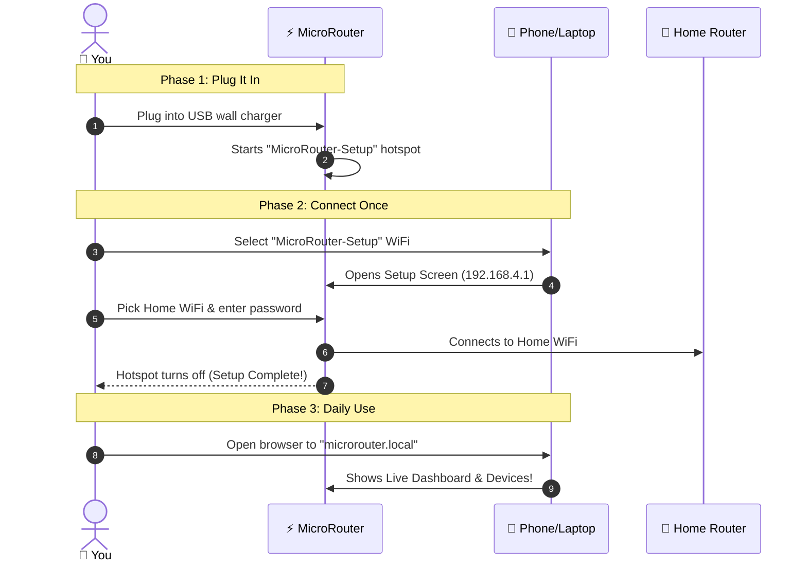

# 🚀 MicroRouter: Beginner & First-Timer Onboarding Guide
### *Transform Your Home WiFi Without Touching Complicated Settings*

Welcome to **MicroRouter**! If you are not a "tech person" and terms like IP addresses, subnets, and firmware sound intimidating—**don't worry!** You are in the right place. 

This guide is designed for complete beginners to get up and running in **under 3 minutes**.

---

## 🌟 What is MicroRouter? (In Plain English)

You already have a WiFi box at home from your internet company (Airtel, Jio, ZTE, etc.). 

Most home WiFi boxes have slow, clunky menus that are hard to use on a phone. **MicroRouter is a tiny smart companion gadget** (powered by an ESP32 microchip) that you plug into any USB wall charger. 

It talks to your home WiFi router in the background and gives you a **gorgeous, lightning-fast dashboard on your phone or computer**:

```mermaid
flowchart LR
    Internet((🌐 Internet)) --> Router[📡 Your Home WiFi Router]
    Router -.->|Talks in Background| Companion[⚡ MicroRouter Device<br/>(Plugged into wall)]
    Router --> Phone[📱 Your Phone / Laptop]
    Phone ==>|Open microrouter.local| Companion
```

### What can you do with it?
- 📱 **See Who Is On Your WiFi**: Instantly spot phones, smart TVs, and laptops with clear icons (Apple, Samsung, etc.).
- 🛑 **One-Click Pause / Bedtime**: Temporarily kick a gaming console or tablet off the internet when it's time for dinner or sleep.
- 🛡️ **Network-Wide Ad Blocker**: Block annoying ads, trackers, and malware across all devices at home.
- 🔄 **Remote Reboot Button**: Restart your router from bed without walking over to pull the plug!

---

## 🗺️ The Complete 3-Step Journey



---

## 🔌 Phase 1: The 2-Minute Setup (First Time Only)

You only ever need to do this **once**.

### Step 1: Plug it in
Plug your MicroRouter device into any standard 5V phone charger or USB port near your home router. A tiny blue/green LED will turn on.

### Step 2: Connect to the Setup Hotspot
1. On your phone, tablet, or laptop, open your **WiFi Settings**.
2. Look for the network named:  
   👉 **`MicroRouter-Setup`**
3. Tap it to connect. When asked for a password, enter:  
   🔑 **`setup1234`**

> [!NOTE]
> Your phone may say *"Connected without internet"*. This is completely normal! The MicroRouter is just creating a private temporary room to talk to your phone.

### Step 3: Enter Your Home WiFi
1. A setup page will pop up automatically. *(If it doesn't, simply open Chrome or Safari and go to **`http://192.168.4.1`**)*.
2. You will see a list of nearby WiFi networks.
3. Tap your **Home WiFi**, type your **WiFi password**, and tap **Connect**.
4. That's it! 
   - The device will save your WiFi into its permanent memory.
   - The `MicroRouter-Setup` hotspot will disappear because the device has successfully joined your home network!

---

## 📱 Phase 2: Daily Superpowers (How to Use It)

Now that your MicroRouter is part of your home, you never have to reconnect to any special hotspot.

### How to Open Your Dashboard
Open Safari, Chrome, or any browser on your phone, tablet, or computer while connected to your home WiFi, and visit:

👉 **[http://microrouter.local](http://microrouter.local)**  
*(or bookmark it on your home screen!)*

---

### What You Can Do on the Dashboard:

| Feature | What It Does | Why You'll Love It |
| :--- | :--- | :--- |
| **Connected Devices** | Shows every phone, TV, and computer on your WiFi. | Spot neighbors stealing your WiFi or check if your smart TV is connected. |
| **Instant Block / Waiver** | Block any device with 1 click, or grant a 30-minute temporary waiver. | Great for dinner time or bedtime for kids! |
| **DNS Shield (Ad-Blocker)** | 1-click switch between **AdGuard** (blocks ads), **Cloudflare Family** (blocks adult sites), or **Speed**. | Stop banner ads and popups on all phones without installing apps on every device. |
| **Remote Reboot** | A clean "Restart Router" button in the top right. | Reboot your router from the couch when Netflix stutters. |
| **Network Spyglass** | Real-time live log of domains requested by devices. | Total visibility into what apps on your network are connecting to. |

---

## ❓ Troubleshooting & Frequently Asked Questions

### Q1: Why don't I see `MicroRouter-Setup` in my WiFi list?
> [!TIP]
> **Because your device is already connected to your home WiFi!**  
> The `MicroRouter-Setup` hotspot only turns on when the device does *not* know your WiFi password. If it is already connected, it disables the hotspot so your network stays clean. Simply go straight to **`http://microrouter.local`**.

### Q2: What if `http://microrouter.local` doesn't load?
Some older Android phones or Windows PCs don't support `.local` names.  
Instead, open your router app or check the MicroRouter IP address (e.g. `http://192.168.1.7`) and type that number into your browser.

### Q3: Does MicroRouter slow down my internet?
**No.** MicroRouter does not route heavy video or download traffic through itself. Your internet speeds remain at the full speed of your fiber/cable connection. MicroRouter acts as a smart controller and lightweight DNS shield.

### Q4: Do I need to keep my computer on?
**No.** The MicroRouter is completely self-contained on its own tiny microchip. Once plugged into the wall, it runs 24/7 silently and uses almost zero electricity (less than 1 watt!).

### Q5: How do I move it to a friend's house or change my WiFi?
Go to **Settings** in the dashboard and click **"Reset WiFi"**, or power it on in a location without your home WiFi. It will immediately re-launch **`MicroRouter-Setup`** so you can connect it to a new network!

---

*Enjoy your smarter, safer, and cleaner home WiFi with MicroRouter!*
